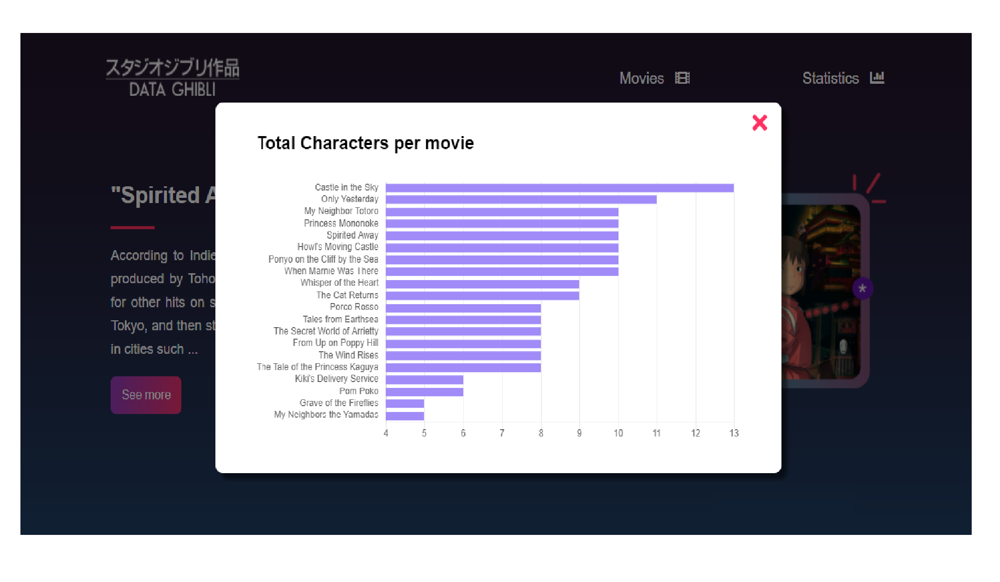

# DATA GHIBLI

DATA GHIBLI es una plataforma web que brinda a los usuarios información detallada sobre las películas del Studio Ghibli. Desde ¿quién es el director de El viaje de Chihiro? o en ¿qué año se realizó Mi vecino Totoro?, todas las respuestas están en esta página web.

## Studio Ghibli 🚀
Studio Ghibi es un estudio de animación japonesa que a través de los años ha logrado tener mucho reconocimiento por la crítica considerándolo uno de los mejores estudios de animación del mundo. El éxito también se ve reflejado en la taquilla pues no solo ha cautivado a japoneses, si no que también al público internacional. Sus películas fueron parte de la vida de muchas personas. Adultos, jóvenes y niños crecieron viendo sus animaciones, dándoles aprendizajes y vivencias que nunca olvidarán. Por eso es importante tener una plataforma en el que personas de cualquier edad puedan acceder a la información de su película favorita del Studio Ghibli.


## Investigación 🔎
### Historias de Usuario
Las historias de usuario son descripciones cortas y simples de una característica contada desde la perspectiva de un usuario.

#### Historia 1
*Yo como usuario web, quiero una página que me permita navegar de manera intuitiva y adaptable para acceder desde otros dispositivos.*
- Criterios de aceptación
    - La interfaz debe mostrar todas las películas del Studio Ghibli de forma ordenada.
    - Debe tener una estructura visual adecuada ( header, main, footer)
    - Tener una paleta de colores que represente el Studio Ghibli.
    - Tener datos adicionales del Studio Ghibli.(redes sociales,páginas web e información extra)
    - Debe tener un diseño que se adapte a todo tipo de dispositivos.

#### Historia 2
*Yo como visitante, quiero un filtro de búsqueda acceder de manera más rápida a las películas.*
- Criterios de aceptación
    - Tiene que tener un buscador que muestre las películas que se pidan.
    - Debe tener filtros de distintas categorías(directores, productores,etc).
    - También que se pueda ordenar por año de realización. De los más recientes a los más antiguos.
    - También que se pueda ordenar alfabéticamente.
    - En caso de que no se encuentre resultados de su busqueda mostrar un mensaje y alternativamente pueda limpiar sus filtros.

#### Historia 3
*Yo como programador, quiero acceder a distintas partes de la web para que me entretenga y que no me vaya de la página.*
- Criterios de aceptación
    - El usuario al darle click a la película, puede acceder a otra ventana.
    - Asi mismo debe haber un botón que retorne a su anterior ventana que navego
    - En esa ventana se muestra toda la información, desde personajes duración valoración, etc.

#### Historia 4
*Yo como dibujante,quiero saber los personajes de cada película para conocer sobre sus características físicas.*
- Criterios de aceptación
    - Todas las películas tienen a sus personajes en la sección de información.
    - Las características deben de estar al lado de la foto del personaje.
    - Adicionalmente se deberá tener información sobre locaciones y vehículos únicos en cada una de las animaciones.
    - Las imágenes deben ser responsivas.

## Definición del producto 📌

#### Usuarios
El público objetivo de esta web son personas que han visto al menos una película del Studio Ghibli y que quieran conocer un poco más de las películas como directores, productores o características de sus personajes favoritos. 
#### Objetivo
Los usuarios pueden acceder, buscar y filtrar de una manera intuitiva todas las películas sin tener ningún problema de usabilidad. 

## Realización ⚙️

#### Prototipo de baja fidelidad
La primera imagen refleja el inicio de la pantalla. Nos basamos bastante en el diseño de Netflix al añadir un slider y un carrusel donde irían las películas.
Al dalre click a la película se abrirá la segunda pantalla en el que se mostrará las características de toda la película como personajes, locaciones y vehículos.


#### Prototipo de alta fidelidad
Luego de recbir feedback nos





### Instalación ⚙️

_Una serie de ejemplos paso a paso que te dice lo que debes ejecutar para tener un entorno de desarrollo ejecutandose_

_Dí cómo será ese paso_

```
Da un ejemplo
```

_Y repite_

```
hasta finalizar
```

_Finaliza con un ejemplo de cómo obtener datos del sistema o como usarlos para una pequeña demo_

## Ejecutando las pruebas ⚙️

_Explica como ejecutar las pruebas automatizadas para este sistema_

### Analice las pruebas end-to-end 🔩

_Explica que verifican estas pruebas y por qué_

```
Da un ejemplo
```

### Y las pruebas de estilo de codificación ⌨️

_Explica que verifican estas pruebas y por qué_

```
Da un ejemplo
```

## Despliegue 📦

_Agrega notas adicionales sobre como hacer deploy_

## Construido con 🛠️

_Menciona las herramientas que utilizaste para crear tu proyecto_

* [Dropwizard](http://www.dropwizard.io/1.0.2/docs/) - El framework web usado
* [Maven](https://maven.apache.org/) - Manejador de dependencias
* [ROME](https://rometools.github.io/rome/) - Usado para generar RSS

## Contribuyendo 🖇️

Por favor lee el [CONTRIBUTING.md](https://gist.github.com/villanuevand/xxxxxx) para detalles de nuestro código de conducta, y el proceso para enviarnos pull requests.

## Wiki 📖

Puedes encontrar mucho más de cómo utilizar este proyecto en nuestra [Wiki](https://github.com/tu/proyecto/wiki)

## Versionado 📌

Usamos [SemVer](http://semver.org/) para el versionado. Para todas las versiones disponibles, mira los [tags en este repositorio](https://github.com/tu/proyecto/tags).

## Autores ✒️

_Menciona a todos aquellos que ayudaron a levantar el proyecto desde sus inicios_

* **Andrés Villanueva** - *Trabajo Inicial* - [villanuevand](https://github.com/villanuevand)
* **Fulanito Detal** - *Documentación* - [fulanitodetal](#fulanito-de-tal)

También puedes mirar la lista de todos los [contribuyentes](https://github.com/your/project/contributors) quíenes han participado en este proyecto. 

## Licencia 📄

Este proyecto está bajo la Licencia (Tu Licencia) - mira el archivo [LICENSE.md](LICENSE.md) para detalles

## Expresiones de Gratitud 🎁

* Comenta a otros sobre este proyecto 📢
* Invita una cerveza 🍺 o un café ☕ a alguien del equipo. 
* Da las gracias públicamente 🤓.
* etc.


---
⌨️ con ❤️ por [Villanuevand](https://github.com/Villanuevand) 😊